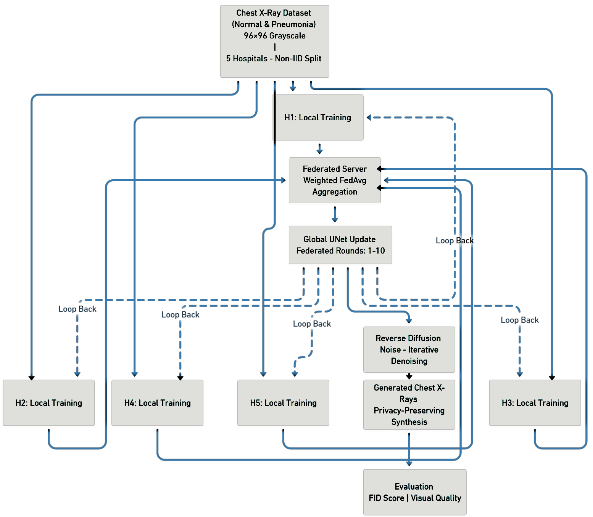
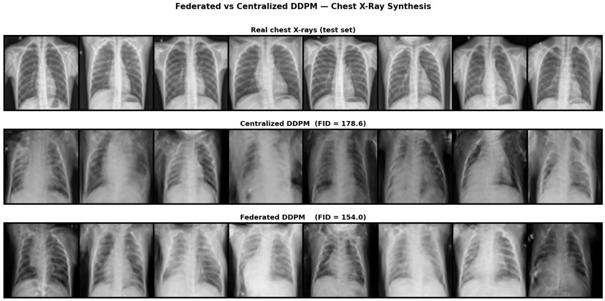

# Federated DDPM for Privacy-Preserving Chest X-Ray Synthesis

A Federated Denoising Diffusion Probabilistic Model (FedDDPM) for
privacy-preserving chest X-ray synthesis across heterogeneous,
non-IID hospital datasets.

## Overview

This project explores whether diffusion models can be trained in a
federated setting without centralizing medical images.

A U-Net-based Denoising Diffusion Probabilistic Model (DDPM) is
trained across five simulated hospitals with deliberately
non-IID Normal/Pneumonia label distributions. Client models are
aggregated using weighted Federated Averaging (FedAvg).

The project uses the Chest X-Ray Images (Pneumonia) dataset and
generates 96×96 grayscale chest X-rays.

## Key Results

| Model | FID ↓ |
|---|---:|
| Centralized DDPM | 178.62 |
| Federated DDPM | **153.99** |

The federated model achieved a **13.8% lower FID** than the
centralized DDPM baseline.

## Key Features

- U-Net-based DDPM architecture
- 1,000-step cosine diffusion noise schedule
- Five simulated non-IID hospital clients
- Weighted Federated Averaging (FedAvg)
- Centralized warm-start initialization
- Exponential Moving Average (EMA) for centralized sampling
- 96×96 grayscale chest X-ray synthesis
- FID-based quantitative evaluation
- Qualitative comparison of real and generated X-rays

## System Architecture

The overall pipeline consists of dataset preprocessing,
non-IID hospital partitioning, local DDPM training, weighted
FedAvg aggregation, global model updates, reverse diffusion
sampling, and FID evaluation.

## Non-IID Federated Setup

The training data is distributed across five simulated hospitals
with deliberately different Normal/Pneumonia distributions.

| Hospital | Normal | Pneumonia | Pneumonia % |
|---|---:|---:|---:|
| H1 | 269 | 80 | 22.9% |
| H2 | 268 | 775 | 74.3% |
| H3 | 268 | 268 | 50.0% |
| H4 | 200 | 775 | 79.5% |
| H5 | 268 | 775 | 74.3% |

This setup is used to study the effect of statistical
heterogeneity on federated diffusion model training.

## Model Architecture

The diffusion model uses a U-Net noise-prediction backbone with:

- Sinusoidal timestep embeddings
- Residual blocks
- Group Normalization
- SiLU activations
- Encoder-decoder skip connections
- Channel widths of `[64, 128, 256, 256]`

Total trainable parameters: approximately **9.05 million**.

## Training Configuration

| Parameter | Value |
|---|---|
| Image size | 96 × 96 |
| Image type | Grayscale |
| Diffusion steps | 1,000 |
| Noise schedule | Cosine |
| Centralized epochs | 40 |
| Federated rounds | 10 |
| Local epochs | 2 |
| Federated optimizer | AdamW |
| Federated learning rate | 5 × 10⁻⁵ |
| Batch size | 32 |
| Gradient clipping | 1.0 |
| Random seed | 42 |

## Results

### Generated Samples

The following comparison shows real test-set chest X-rays,
centralized DDPM outputs, and federated DDPM outputs.

The federated model achieved an FID of **153.99**, compared with
**178.62** for the centralized baseline.

## Privacy

Raw patient images remain within their originating client in the
federated training setup. However, this implementation does not
provide formal differential privacy guarantees.

Gradient inversion and membership inference remain potential
privacy risks. Differential Privacy with DP-SGD is identified as
future work.

## Limitations

- FID evaluation uses 512 samples due to GPU constraints.
- Federated training is simulated sequentially on a single GPU.
- The diffusion model is unconditional and does not explicitly
  control Normal vs Pneumonia generation.
- The simulated hospitals do not represent real clinical
  infrastructure.

## Future Work

- Differentially private federated training
- Conditional FedDDPM for class-guided synthesis
- Faster DDIM sampling
- Transformer-based diffusion backbones
- Extension to CT and MRI
- Evaluation on real multi-institutional federated infrastructure

## Tech Stack

- Python
- PyTorch
- Torchvision
- CUDA
- NumPy
- Matplotlib
- Federated Learning
- DDPM
- U-Net
- Medical Image Synthesis

## Dataset

Experiments use the Chest X-Ray Images (Pneumonia) dataset.

The dataset is **not included in this repository**.

## Project Documentation

The repository includes the project report and exported
experimental notebook for reference.

## Author

Prathish A  
